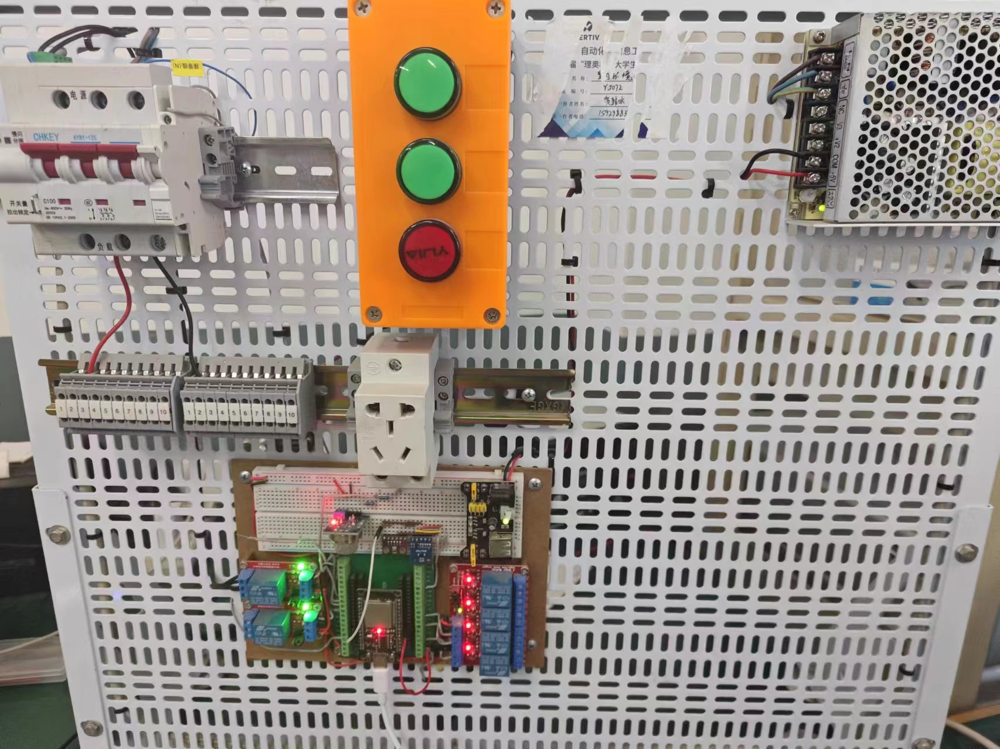

# 智慧LAB物联网模拟装置

基于ESP32,MQ-2,BH1750,BME280,断路器和四路继电器的物联网模拟装置，用于模拟物联网设备。




### 五、通信与控制(MQTT)

#### 设备注册

主题:
```
homeassistant/sensor/{device_id}_temperature/config
homeassistant/sensor/{device_id}_humidity/config
homeassistant/sensor/{device_id}_pressure/config
homeassistant/sensor/{device_id}_lightIntensity/config
homeassistant/sensor/{device_id}_smokeDensity/config
homeassistant/switch/{device_id}_relay_1/config
homeassistant/switch/{device_id}_relay_2/config
homeassistant/switch/{device_id}_relay_3/config
homeassistant/switch/{device_id}_relay_4/config
homeassistant/switch/{device_id}_circuit_breaker/config
```
注意: 每个实体的 config 主题必须唯一，否则 Home Assistant 无法正确区分它们。因此这里把设备分为了多个实体。

内容:
```json
[
    {
        "name": "{device_name}-温度",
        "unique_id": "{device_id}_temperature",
        "device": {
            "name": "{device_name}",
            "model": "{device_model}",
            "manufacturer": "{device_manufacturer}",
            "identifiers": ["{device_id}"]
        },
        "state_topic": "home/device/{device_id}/state",
        "value_template": "{{ value_json.temperature }}",
        "unit_of_measurement": "°C"
    },
    {
        "name": "{device_name}-湿度",
        "unique_id": "{device_id}_humidity",
        "device": {
            "name": "{device_name}",
            "model": "{device_model}",
            "manufacturer": "{device_manufacturer}",
            "identifiers": ["{device_id}"]
        },
        "state_topic": "home/device/{device_id}/state",
        "value_template": "{{ value_json.humidity }}",
        "unit_of_measurement": "%"
    },
    {
        "name": "{device_name}-气压",
        "unique_id": "{device_id}_pressure",
        "device": {
            "name": "{device_name}",
            "model": "{device_model}",
            "manufacturer": "{device_manufacturer}",
            "identifiers": ["{device_id}"]
        },
        "state_topic": "home/device/{device_id}/state",
        "value_template": "{{ value_json.pressure }}",
        "unit_of_measurement": "hPa"
    },
    {
        "name": "{device_name}-光照强度",
        "unique_id": "{device_id}_lightIntensity",
        "device": {
            "name": "{device_name}",
            "model": "{device_model}",
            "manufacturer": "{device_manufacturer}",
            "identifiers": ["{device_id}"]
        },
        "state_topic": "home/device/{device_id}/state",
        "value_template": "{{ value_json.lightIntensity }}",
        "unit_of_measurement": "lx"
    },
    {
        "name": "{device_name}-烟雾浓度",
        "unique_id": "{device_id}_smokeDensity",
        "device": {
            "name": "{device_name}",
            "model": "{device_model}",
            "manufacturer": "{device_manufacturer}",
            "identifiers": ["{device_id}"]
        },
        "state_topic": "home/device/{device_id}/state",
        "value_template": "{{ value_json.smokeDensity }}",
        "unit_of_measurement": "ppm"
    },
    {
        "name": "{device_name}-继电器-1",
        "unique_id": "{device_id}_relay_1",
        "device": {
            "name": "{device_name}",
            "model": "{device_model}",
            "manufacturer": "{device_manufacturer}",
            "identifiers": ["{device_id}"]
        },
        "state_topic": "home/device/{device_id}/state",
        "command_topic": "home/device/{device_id}/set",
        "payload_on": 1,
        "payload_off": 0,
        "value_template": "{{ value_json.relayStatus_1 }}",
        "command_template": "{ \"relay_1\": {{ value }} }"
    },
    {
        "name": "{device_name}-继电器-2",
        "unique_id": "{device_id}_relay_2",
        "device": {
            "name": "{device_name}",
            "model": "{device_model}",
            "manufacturer": "{device_manufacturer}",
            "identifiers": ["{device_id}"]
        },
        "state_topic": "home/device/{device_id}/state",
        "command_topic": "home/device/{device_id}/set",
        "payload_on": 1,
        "payload_off": 0,
        "value_template": "{{ value_json.relayStatus_2 }}",
        "command_template": "{ \"relay_2\": {{ value }} }"
    },
    {
        "name": "{device_name}-继电器-3",
        "unique_id": "{device_id}_relay_3",
        "device": {
            "name": "{device_name}",
            "model": "{device_model}",
            "manufacturer": "{device_manufacturer}",
            "identifiers": ["{device_id}"]
        },
        "state_topic": "home/device/{device_id}/state",
        "command_topic": "home/device/{device_id}/set",
        "payload_on": 1,
        "payload_off": 0,
        "value_template": "{{ value_json.relayStatus_3 }}",
        "command_template": "{ \"relay_3\": {{ value }} }"
    },
    {
        "name": "{device_name}-继电器-4",
        "unique_id": "{device_id}_relay_4",
        "device": {
            "name": "{device_name}",
            "model": "{device_model}",
            "manufacturer": "{device_manufacturer}",
            "identifiers": ["{device_id}"]
        },
        "state_topic": "home/device/{device_id}/state",
        "command_topic": "home/device/{device_id}/set",
        "payload_on": 1,
        "payload_off": 0,
        "value_template": "{{ value_json.relayStatus_4 }}",
        "command_template": "{ \"relay_4\": {{ value }} }"
    },
    {
        "name": "{device_name}-断路器",
        "unique_id": "{device_id}_circuit_breaker",
        "device": {
            "name": "{device_name}",
            "model": "{device_model}",
            "manufacturer": "{device_manufacturer}",
            "identifiers": ["{device_id}"]
        },
        "state_topic": "home/device/{device_id}/state",
        "command_topic": "home/device/{device_id}/set",
        "payload_on": 1,
        "payload_off": 0,
        "value_template": "{{ value_json.circuitBreakerStatus }}",
        "command_template": "{ \"circuit_breaker\": {{ value }} }"
    }
]
```

#### 上报状态

主题: `"home/device/{device_id}/state"` 其中 `device_id` 为设备ID 唯一标识

负载:
```json
{
		"temperature": "25.00",
		"humidity": "50.00",
		"pressure": "101325.00",
		"lightIntensity": "300.00",
		"smokeDensity": "0.00",
		"relayStatus_1": 0,
		"relayStatus_2": 0,
		"relayStatus_3": 0,
		"relayStatus_4": 0,
		"circuitBreakerStatus": 0
}
```	

#### 控制设备
主题: `home/device/{device_id}/set` 其中 `device_id` 为设备ID 唯一标识

负载:
```json
{
		"relay_1": 1,
		"relay_2": 0,
		"relay_3": 1,
		"relay_4": 0,
		"circuit_breaker": 1
}
```
